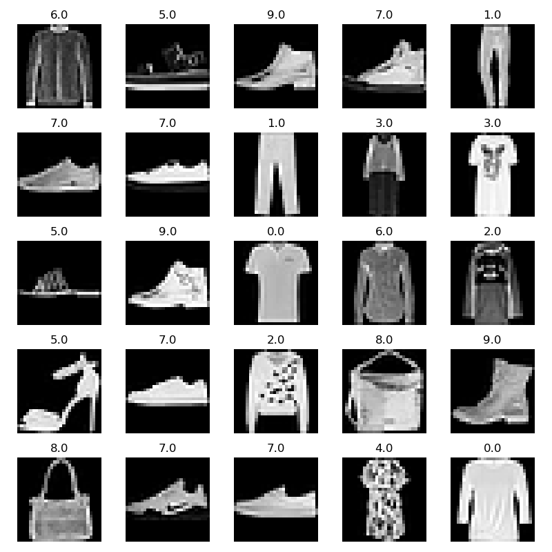
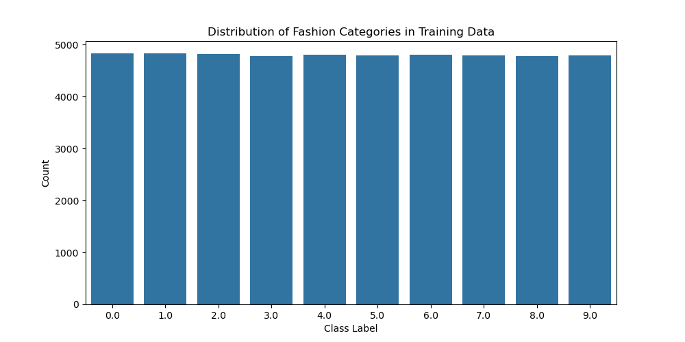
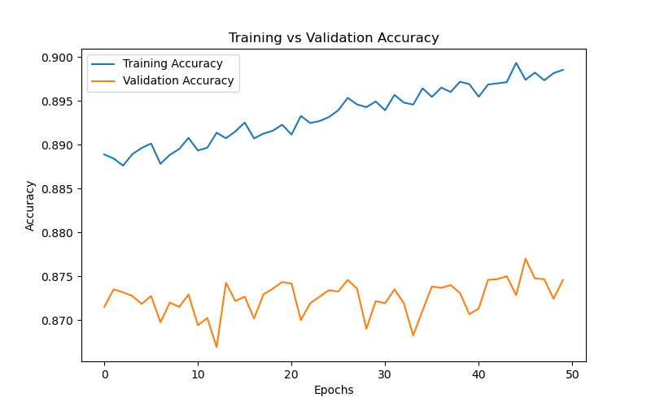
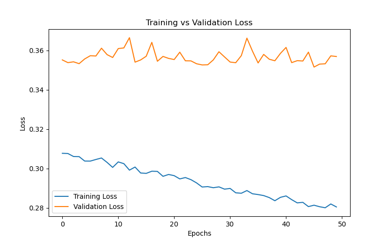
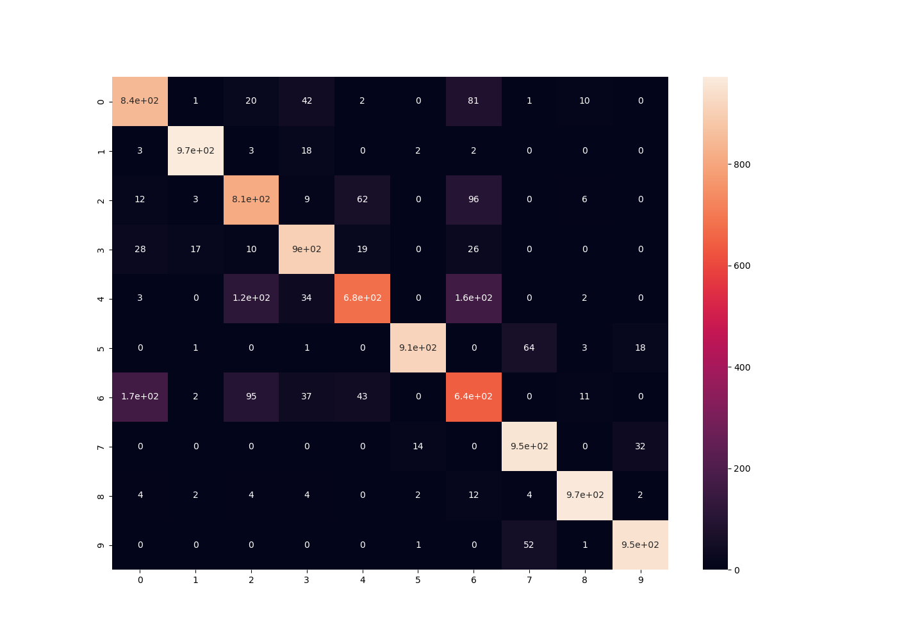

# 👗 Fashion Class Classification using Deep Learning (CNN-based Project)

## 🧾 Overview

This project demonstrates how **Computer Vision** and **Deep Learning** can be applied to understand fashion — by automatically recognizing clothing items from grayscale images.  

The goal is to simulate a **virtual stylist assistant** that can analyze user-uploaded photos (like from Instagram or e-commerce platforms) and identify what type of fashion item it is — such as a *T-shirt*, *Bag*, *Sneaker*, or *Dress*.  

By classifying these images into well-defined categories, retailers and fashion companies can:  
- Detect and forecast **emerging fashion trends**  
- Personalize **product recommendations**  
- Design **targeted marketing campaigns**  
- Automate **catalog management** for e-commerce  

This project was implemented using the **Fashion-MNIST** dataset and a **Convolutional Neural Network (CNN)** built with **TensorFlow/Keras**.

---

## 🎯 Objective

The **objective** of this project is to build an end-to-end **image classification model** that can:
1. Accurately recognize fashion products from grayscale images.  
2. Learn complex patterns such as textures, edges, and shapes.  
3. Generalize well on unseen images.  
4. Achieve at least **90% accuracy** on the Fashion-MNIST test dataset.  

Additionally, the model aims to:
- Demonstrate the effectiveness of **CNNs** in vision-based tasks compared to traditional dense (fully connected) neural networks.  
- Showcase how **deep learning architectures** mimic human visual perception.

---

## 💡 Why Use CNN (Convolutional Neural Network)?

Traditional machine learning models (like logistic regression, SVMs, or dense neural networks) treat images as **flat vectors** of numbers — ignoring how pixels relate to each other spatially.  
This means they fail to capture **spatial dependencies** such as edges, corners, or shapes that define objects.

A **Convolutional Neural Network (CNN)** solves this by **preserving spatial structure** in the image.

### 🧩 Why CNNs are Perfect for this Project

1. **Local Feature Extraction**  
   CNNs apply **convolutional filters (kernels)** that scan small areas of the image (like 3×3).  
   Each filter detects simple patterns — edges, curves, or gradients — which later combine to form complex patterns such as “sleeves” or “laces”.

2. **Hierarchical Learning**  
   - First layers learn **low-level features** (edges, corners).  
   - Deeper layers learn **high-level features** (shapes, textures).  
   - Enables complex object recognition.

3. **Parameter Efficiency**  
   CNNs reuse weights through filters — fewer parameters, faster training, less overfitting.

4. **Translation Invariance**  
   Pooling layers help the model recognize objects even when slightly rotated, scaled, or shifted.

5. **Industry Relevance**  
   CNNs are the foundation of modern visual AI systems — used in **Amazon**, **Pinterest**, and **Google Lens** for image tagging and recommendation.

---

## 📘 Dataset: Fashion-MNIST

The **Fashion-MNIST dataset**, developed by Zalando Research, is a more challenging version of the classic MNIST dataset.  
It contains grayscale images of clothing items and is widely used for benchmarking image classification algorithms.

| Property | Details |
|-----------|----------|
| **Images** | 70,000 total (60,000 train + 10,000 test) |
| **Image Size** | 28 × 28 pixels (grayscale) |
| **Classes** | 10 fashion categories |
| **Format** | CSV (flattened pixel arrays) |

**Class Labels:**
1. T-shirt/top  
2. Trouser  
3. Pullover  
4. Dress  
5. Coat  
6. Sandal  
7. Shirt  
8. Sneaker  
9. Bag  
10. Ankle boot

## 📦 Dataset Source

Due to GitHub's 25MB file size limit, the dataset files (`fashion-mnist_train.csv` and `fashion-mnist_test.csv`) are **not included** in this repository.

You can download them directly from Kaggle:
🔗 [Fashion MNIST Dataset on Kaggle](https://www.kaggle.com/datasets/zalando-research/fashionmnist)

---

1. **Data Import:**  
   Loaded the training and testing datasets from CSV format using `pandas`.  

2. **Normalization:**  
   Scaled all pixel values (0–255) to the range (0–1).  

3. **Reshaping:**  
   Reshaped images from (784,) to (28, 28, 1) to preserve 2D structure.  

4. **Train-Validation Split:**  
   80% of training data used for model training and 20% used for validation to monitor overfitting.

---

## 🧠 Model Architecture

| Layer Type | Description |
|-------------|--------------|
| **Conv2D (32 filters, 3×3)** | Extracts local features from images |
| **ReLU Activation** | Adds non-linearity |
| **MaxPooling2D (2×2)** | Reduces dimensionality while keeping important features |
| **Flatten** | Converts 2D feature maps into 1D vectors |
| **Dense (32 neurons, ReLU)** | Fully connected layer for feature combination |
| **Dense (10 neurons, Softmax)** | Output layer for multi-class classification |

**Loss Function:** Categorical Crossentropy  
**Optimizer:** Adam  
**Metric:** Accuracy  

---

## 🧩 Why ReLU, MaxPooling, and Softmax?

| Component | Purpose |
|------------|----------|
| **ReLU (Rectified Linear Unit)** | Prevents vanishing gradients and accelerates training |
| **MaxPooling** | Reduces overfitting and computational cost |
| **Softmax** | Converts raw outputs to class probabilities |

---

## 🧪 Model Training

- **Epochs:** 50  
- **Batch size:** 512  
- **Validation data:** 20% of training set  
- **Framework:** TensorFlow/Keras  

Training accuracy reached **~95%**, and test accuracy stabilized around **~91%** after applying Dropout regularization.

---

## 📈 Model Evaluation

After training, the model was tested on unseen images.  

| Model Setup | Train Accuracy | Test Accuracy |
|--------------|----------------|---------------|
| 32 filters, no dropout | 95% | 91.1% |
| 64 filters, no dropout | 96% | 91.6% |
| 64 filters + dropout | 94% | **91.9%** ✅ |

---

### 🔍 Evaluation Metrics

1. **Confusion Matrix:**  
   Visualized correct and incorrect classifications per class.

2. **Classification Report:**  
   Measured *precision*, *recall*, and *F1-score* for each of the 10 classes.

3. **Visualization:**  
   Displayed sample predictions — showing predicted vs actual labels.

**Key Observations:**
- Easy to classify: *Trouser, Sandal, Bag, Sneaker*  
- Harder to classify: *Shirt* (often confused with *T-shirt* or *Pullover*)  
- Dropout helped generalization by preventing overfitting.

---

## 📊 Results & Visualizations

Below are key visualizations that represent how our CNN model learned and performed.

---

### 🖼️ Sample Fashion Images
The dataset contains grayscale images representing 10 fashion categories.  
This grid shows random samples from the dataset.

---

### 📦 Class Distribution
Each bar shows how many samples exist for each fashion class.  
All bars are equal — meaning our data is perfectly balanced, giving the model fair training.

---

### 📈 Training vs Validation Accuracy
As training goes on, the blue line (training accuracy) rises steadily.  
The orange line (validation accuracy) follows — showing that the model isn’t just memorizing, but truly learning.

---

### 📉 Training vs Validation Loss
Here we track how much the model’s “mistake level” decreases.  
Both curves drop, meaning it’s learning efficiently, though validation loss stays slightly higher (normal for unseen data).

---

### 🔍 Confusion Matrix
This heatmap shows how well each class was predicted.  
Bright diagonal boxes = correct predictions!  
The lighter the box, the more confident our model was.

---

Think of the computer as a little kid learning fashion 👧:

- First, it looks at thousands of pictures of clothes 👗👟🧥  
- It slowly starts recognizing patterns — “Oh! Shoes have soles, shirts have sleeves!”  
- The accuracy chart shows the kid getting better after each practice.  
- The loss chart shows fewer mistakes over time (fewer “oops” moments 😅).  
- Finally, the confusion matrix is like a report card showing what the kid got right and what still confuses them (like mixing up shirts and pullovers).

At the end, the kid becomes a mini **fashion expert**, correctly naming 9 out of 10 items! 🎓

---

## 🧰 Dropout: Why and How It Helps

**Dropout** randomly deactivates a percentage of neurons during training.  
This helps the model learn independent patterns and avoid memorizing the training data.

In this project:  
- Dropout (rate = 0.3) slightly reduced training accuracy but **improved test accuracy** — showing better generalization.

---

## 🛠 Tools and Technologies

| Tool / Library | Purpose |
|-----------------|----------|
| **Python 3.x** | Programming language |
| **TensorFlow / Keras** | Deep learning framework |
| **NumPy, Pandas** | Data manipulation |
| **Matplotlib, Seaborn** | Data visualization |
| **Scikit-learn** | Evaluation metrics (confusion matrix, classification report) |

---

## 🚀 Future Enhancements

1. **Use the DeepFashion dataset** with 800K high-quality color images.  
2. **Apply Transfer Learning** using pre-trained CNNs (ResNet, VGG16, MobileNet).  
3. **Deploy the Model** using Streamlit or Gradio as a web app.  
4. **Add Color and Texture Analysis** by expanding from grayscale to RGB channels.  
5. **Explainable AI (Grad-CAM)** to visualize which image regions influenced predictions.

---

## 📊 Results Summary

| Stage | Achievement |
|--------|--------------|
| **Data Preprocessing** | Normalized and reshaped 70K grayscale images |
| **Model Building** | Constructed CNN with convolution, pooling, and dense layers |
| **Training** | Achieved 95% training accuracy |
| **Evaluation** | Achieved 91.9% test accuracy with dropout |
| **Outcome** | Successfully classified 10 fashion categories |

---

## 🧠 What I Learned

- The significance of **spatial relationships** in image data.  
- How **CNNs** automatically extract hierarchical features.  
- How to balance training and validation accuracy using regularization.  
- Implementation of **Keras layers** like Conv2D, MaxPooling, and Dropout.  
- How to evaluate models using **confusion matrices** and **F1-scores**.

---

## 📂 Files Included

| File | Description |
|------|-------------|
| `Fashion_Class_Classification.ipynb` | Full project notebook |
| `fashion-mnist_train.csv` | Training dataset |
| `fashion-mnist_test.csv` | Testing dataset |

---

## 👩‍💻 Author

**Developed by:** *Pournima Kamble*  
🎓 Master’s in Computer Science | Passionate about AI, Machine Learning, and Computer Vision  
📍 Cleveland, Ohio  

